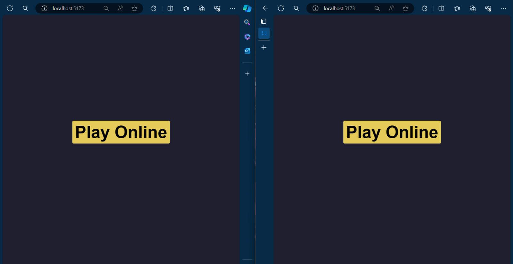
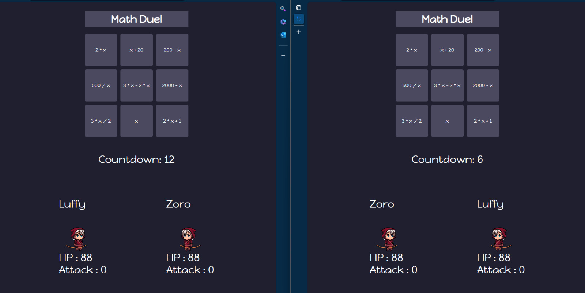

# __Math Duel 🟰✖️__

## How to run the project
#### Install dependencies
	npm install --save

#### Install Vite
	npm install -g vite

#### Run the client side part
	npm run dev

#### Run the server side part
	nodemon server.js

## Game Details
"Math Duel" is an engaging and interactive game designed to help players sharpen their calculation and cognitive decision-making skills.

The game operates in two-player mode, providing an incredible opportunity for friends to learn and have fun together.

### Gameplay
Two players can play at a time. A timer starts counting down at the start of the game, and players must select a mathematical expression from the math pool (matrix). The chosen expression, along with the time taken, determines the attack power of the player. After this, the attack phase begins, and the respective attacks are carried out. The player with less health, or the one who reaches zero health first, loses. Conversely, the other player wins.

### Starting Screen

### Player Input

### Countdown Screen

